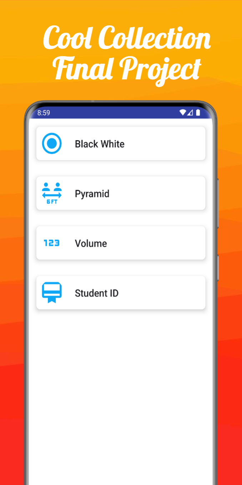

 

# Mathverse

## Introduction
Mathverse is an Android application, a collection of final projects, designed to provide various math-themed educational games and utilities. This application aims to make learning mathematics more interactive and fun.

## Key Features
Mathverse comes with several interesting features, including:
*   **Black & White (B&W) Game**: Challenge your calculation and logic skills with a math game presented in a sleek black and white visual theme.
*   **Pyramid Game**: Test your problem-solving and strategic thinking with math challenges structured in an engaging pyramid format.
*   **Student Data Management**: Easily manage student lists and their detailed information. This feature can be used for personalizing the learning experience, tracking progress, or for other administrative needs in an educational setting.

## Project Configuration
To set up and run the Mathverse project in your development environment:
1.  **Clone Repository**: Make sure you have cloned this project repository to your local machine.
2.  **Open with Android Studio**: Open the project using Android Studio. The IDE will automatically handle the required dependencies.
3.  **Gradle Sync**: If prompted, or if you have just pulled changes, perform a Gradle sync to ensure all dependencies are downloaded and the project is configured correctly.
4.  **Build and Run**: Select the appropriate build configuration (e.g., 'debug' or 'release') and run the application on an Android emulator or a connected physical device.
    *   Ensure that the required Android SDK and build tools are installed via the SDK Manager in Android Studio.

## Screenshots
   
